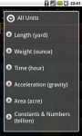

# Android Units

![][0]

Android Units is a powerful unit-aware calculator that can also easily perform simple unit conversions. It's inspired by GNU Units.

## Download

You can [download Units from the Android market][1] or directly from [Units.apk][2]. The [changelog][3] is below.

## Usage

### key

Anything that is shown within a dotted box can be entered into Units. Eg. `m³÷hr`

Place the value and the unit you want to convert from in the "you have" box (eg. `4.9inches`) and the unit you wish to convert to in the "you want" box (eg. `cm`). To enter units, either press the "unit" button and select from the list, or tap on the input box a second time and an on-screen keyboard should pop up.

You can enter simple units, such as `cm`/`centimeter` or complex units, such as `m^3÷hr`. You can press the "unit" button to show a list of all the units. If you don't specify a "to" unit, it will provide a definition in base units. For a list of examples, please see below.

## Auto-completion

Both "you have" and "you want" will auto-complete with all the known units, sorted by usage. The more you use a given unit, the closer it is to the top of the list. The usage is seeded with initial usage amounts for common units, including some regional adjustments based on your device's locale.

Units will not start off auto-completing every possible permutation of metric prefix (eg. `deci`, `centi`, `milli`) with unit name (`meter`, `liter`). Once you make a calculation with a prefix+unit combination, Units will remember it and auto-complete it from then-on.

## Reciprocal detection

Units will auto-detect instances where you may have forgotten to convert from the reciprocal of a given value. For instance, if you enter `100mpg` and ask for `liter÷100km`, it will compute it using the reciprocal of the "from" value (`1÷(100mpg)`) and provide a warning that it used the reciprocal.

## Calculations

You can enter complex calculations in both input areas. For example, you can add two conformable units such as, `2 cm + (4 + (1/2)) in` or multiply values to higher dimensions, such as, `3m × 1m × 2cm` to convert to `liter` or `m^3`. You can even convert to an arbitrary complex unit, provided that everything conforms properly.

## Examples

### Practical conversions

- US→EU height conversion
`5ft + 6in` = **167.64**`cm`
- UK→US mass conversion
`13 stone` = **182**`lbs`
- Volume conversion
`10cm×5cm ×3cm` = **0.15**`liter`
- Kitchen: volume to mass
`1cup flour_sifted` = **113.398094**`g`
- Driving: time to distance
`100kph ×5minute` = **5.1780934**`mile`

### Making lemonade, nutritional info

- How much sugar does it have compared to other drinks?
`1cup sugar ÷0.5gallon` = **25.0**`gram ÷8floz`
- What percent juice is it?
`1cup ÷0.5gallon` = **12.5**`percent`
In comparison (per. 8floz), Minute Maid® Lemonade has 3% juice and 27g sugar. Coke has 46g sugar per. 8floz.

### Fun conversions

As you can see above, Units knows a number of units that are useful in the kitchen. Most are for volume↔mass conversion (which can be found under "density"), such as `flour_scooped`, `sugar`, and `butter`. It also has a few known masses, such as `eggs`, `stickbutter` and `venusmass`.

- Your mass in eggs
`78kg` = **1560**`eggs`
- Time to walk across the U.S. (without sleeping)
`2600mile ÷3mph` = **5.15873**`week`
- Time to walk across the U.S. (assuming walking only 8 hours per day)
`2600mile ÷(3mph ×(8hour ÷day))` = **15.47619**`week`
- Gasoline efficiency in an alternative unit
`1÷(25mile ÷gallon)` = **79.36508**`microhogshead ÷furlong`

### Science &amp; Physics

- Electricity
`3volt ×150mA` = **0.45**`watt`
- Approximate time it takes light to get from the sun to the Earth.
`sundist ÷c` = **8.316755**`minute`
- EM frequency to wavelength
`light ÷2.417GHz` = **12.403494**`cm`
- using e=mc² to figure out how much energy 1g of matter is equivalent to
`1gram energy` = **21.480764**`kiloton tnt`

## Changelog

* 15 September, 2011: 1.0 - Added advanced keypad and improved keypad UI. Adds Russian translations. Numerous bug fixes.
* 13 January, 2011: 0.9 - Improved interface graphics. Fixed bug with imperial units showing up in non-US,UK locales. Fixed loss of precision of output. Fixed various crashes and database bugs.
* 10 December, 2010: 0.8 - Fixed temperature conversion and other functions. Added parenthesis auto-complete.
* 02 December, 2010: 0.7 - Added search and browse. Added Italian translation.
* 30 August, 2010: 0.6 - Added unit classification to unit browser.
* 17 August, 2010: 0.5 - Added pop-up unit browser; major overhaul of unit database backend.
* 12 August, 2010: 0.4.1 - Added database-backed history; improved saved state so rotation doesn't clear recent result
* 20 July, 2010: 0.4 - Units entry now conforms to opposite entry field.
* 12 July, 2010: 0.3 - First version to hit the Market

### Support Android Units

![][4]

If you like Units and wish to donate to the devlopers, please visit the [Units project page][5].

## This is free software / open source

Units is an Android interpretation of the classic [GNU Units][6] utility, using [Units in Java][7] for all the heavy lifting.

If you wish to get the source to this application and/or contribute to its ongoing development, please visit the [Android Units project page][5].

The source is available by way of the [Android Units git repository][8]. You can grab a copy for yourself by running:

    git clone git://staticfree.info/git/Units/

Units needs translators! If you'd like to contribute a translation, please visit the [Units Translation Page][9] and request access.

## License (GPLv3)

Android Units  
©2010-2011 Steve Pomeroy, contributors (below)

This program is free software: you can redistribute it and/or modify it under the terms of the GNU General Public License as published by the Free Software Foundation, either version 3 of the License, or (at your option) any later version.

This program is distributed in the hope that it will be useful, but WITHOUT ANY WARRANTY; without even the implied warranty of MERCHANTABILITY or FITNESS FOR A PARTICULAR PURPOSE. See the GNU General Public License for more details.

You should have received a copy of the GNU General Public License along with this program. If not, see [http://www.gnu.org/licenses/][10].

## Contributors

Units is an ongoing project, with volunteers contributing freely to it. We would like to thank:

* [Andrejs Gorbunovs][11] - Russian translations

[0]: res/drawable-mdpi/icon.png
[1]: market://search?q=pname:info.staticfree.android.units
[2]: Units.apk
[3]: #changelog
[4]: https://www.paypalobjects.com/WEBSCR-640-20110401-1/en_US/i/scr/pixel.gif
[5]: http://staticfree.info/projects/units/
[6]: http://www.gnu.org/software/units/
[7]: http://units-in-java.sourceforge.net/
[8]: git://staticfree.info/git/Units/
[9]: http://mygengo.com/string/p/android-units-1/
[10]: http://www.gnu.org/licenses/
[11]: mailto:andrejs.gorbunovs@inbox.lv
